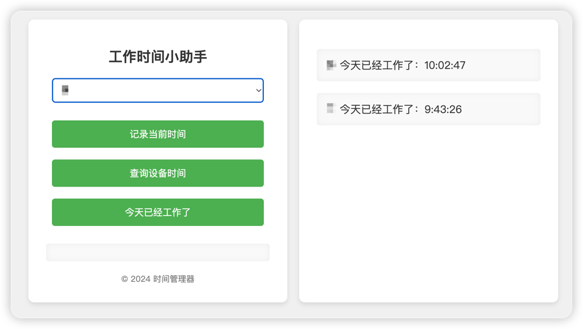
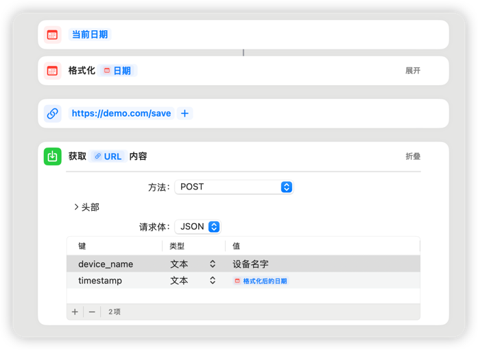

# work-timer

## 用来记录和展示今天工作了多久


### RoadMap
- [x] 记录和查询的API
- [x] 简单的Web界面
- [x] 自动化docker构建
- [x] 快捷指令 
- [ ] OpenWRT插件

### 网页




### IOS 快捷指令实现自动记录
https://www.icloud.com/shortcuts/a582f25607024a989c5aaa2b1a19784e




### API

### 记录特定设备的当前的时间
POST https://demo.com/save
Content-Type: application/json

{
"device_name": "b",
"timestamp": "123"
}


### 查询特定设备所有记录的时间
GET http://demo.com/query?device_name=b


### 查询特定设备今天工作了多久
GET https://demo.com/query_today_first?device_name=aaa


## 部署
推荐使用docker-compose部署, 但其实部署在任何支持python的地方都可以

```docker-compose
version: '3.7'
services:
web:
image: xiebaiyuan/work-timer:lastest
platform: linux/amd64
ports:
- "8888:5000"
environment:
- FLASK_ENV=development
- REDIS_HOST=redis
- REDIS_PORT=6379
depends_on:
- redis
volumes:
- /etc/localtime:/etc/localtime:ro  # 共享主机时间
redis:
image: "redis:alpine"
platform: linux/amd64
ports:
- "6379:6379"
volumes:
- /etc/localtime:/etc/localtime:ro  # 共享主机时间

```

## PS
家人公司要求若干小时， 导致每天都得记一下几点来的，不然夜里可能都不达标？

网上找半天没找到，想想就低成本实现了一个，
 奈何本人前端后端都是很弱，就随便用flask + redis实现了一个部署在nas上了，欢迎大神搞个完美方案。

## [**我的博客**](www.xiebaiyuan.top)